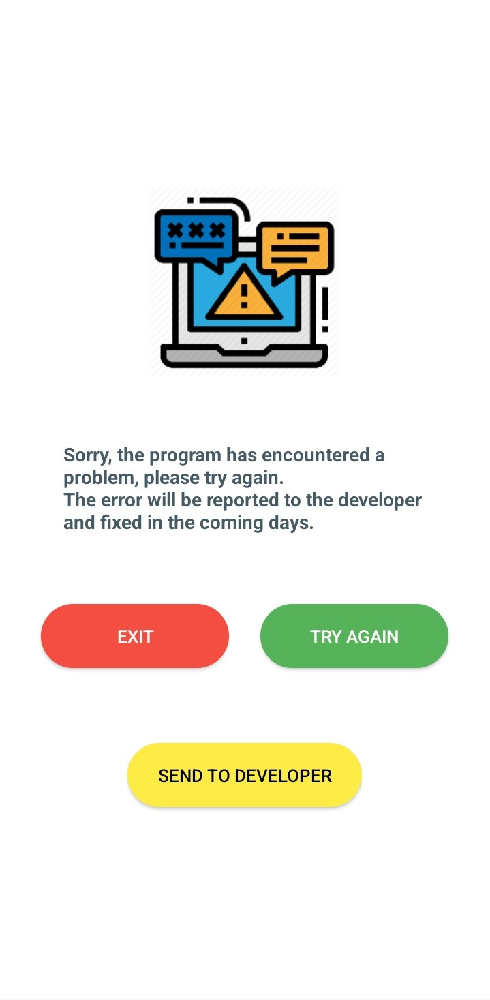
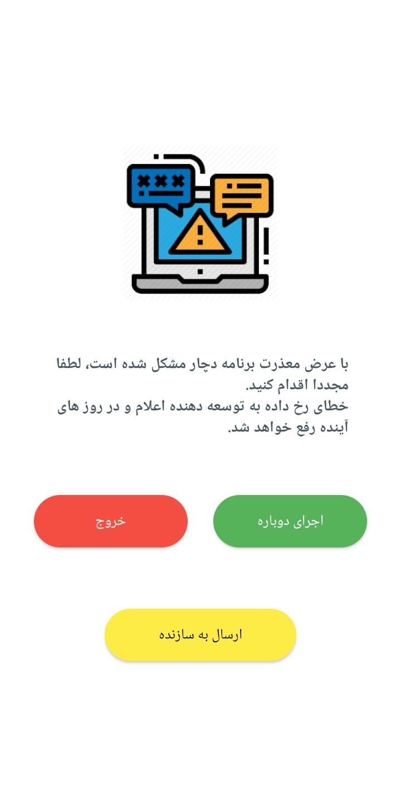

# react-native-error-handling

error handling



## Installation

npm:

```sh
npm install react-native-error-handling
```

yarn:

```sh
yarn add react-native-error-handling
```

MainApplication.java

```java
import com.errorhandling.utils.ExceptionHandler;
...

  @Override
  public void onCreate() {
    super.onCreate();

    Thread.setDefaultUncaughtExceptionHandler(
            new ExceptionHandler(
                    getBaseContext(),
                    "http://192.168.1.1:8000/api/app/report",//api post info, error, file
                    MainActivity.class,// run this activity
                    true//show button send error
            )
    );

    ...
  }
```

## Usage

```js
import { log, logV, logE, logS, testError } from 'react-native-error-handling';

// ...

log('E', 'name_log', 'message');
logV('name_logV', { message: 'text', other: '...' });
logE('name_logE', 1);
logS('name_logS');
testError(); //make crash divide by zero
```

## Customize

edit res/values/strings.xml your porject

```xml
<string name="rneh_not_found">موردی برای نمایش وجود ندارد!</string>
<string name="rneh_error_system">با عرض معذرت برنامه دچار مشکل شده است، لطفا مجددا اقدام کنید.\nخطای رخ داده به توسعه دهنده اعلام و در روز های آینده رفع خواهد شد.</string>
<string name="rneh_btn_run_again">اجرای دوباره</string>
<string name="rneh_btn_exit">خروج</string>
<string name="rneh_btn_share">ارسال به سازنده</string>

```



## Contributing

See the [contributing guide](CONTRIBUTING.md) to learn how to contribute to the repository and the development workflow.

## License

MIT

---

Made with [create-react-native-library](https://github.com/callstack/react-native-builder-bob)
